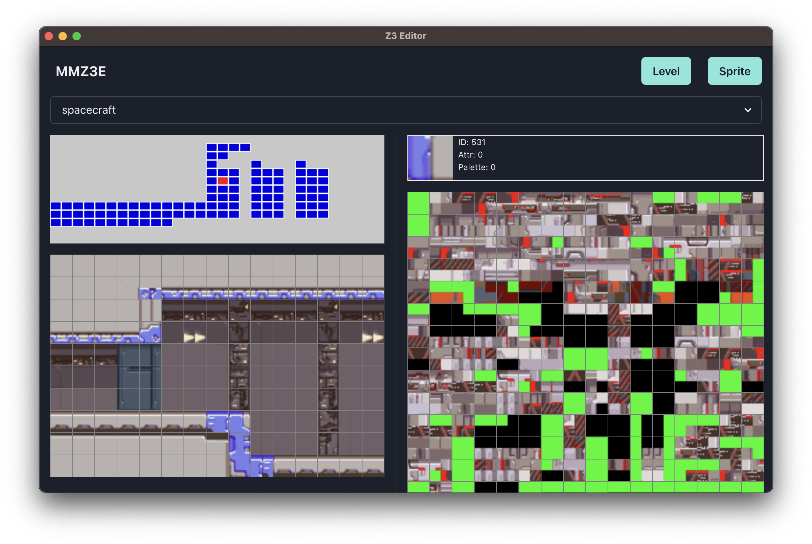
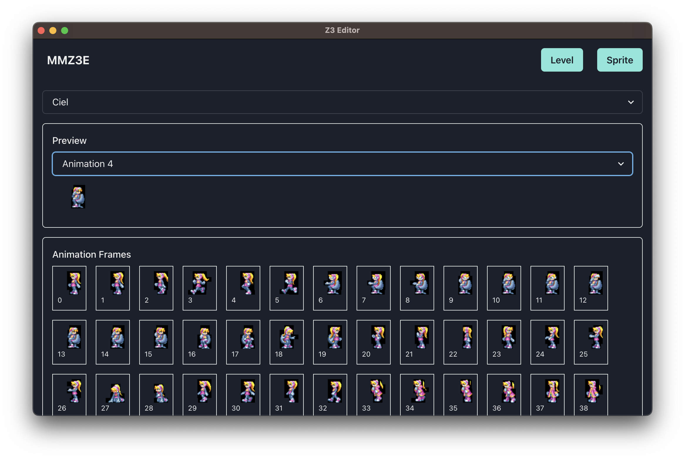

# mmz3e

>**Warning**  
> This project is still in development, so data can be viewed but not edited yet.

mmz3e is a tool for editing Megaman Zero 3 (Japan) ROM.





## Usage

```bash
$ yarn
$ yarn dev
```

Click `Load Project` and select `mmzret/rmz3` in your local PC.

### Build

```bash
$ yarn build:win # For windows
$ yarn build:mac # For macOS
$ yarn build:linux # For Linux
```

